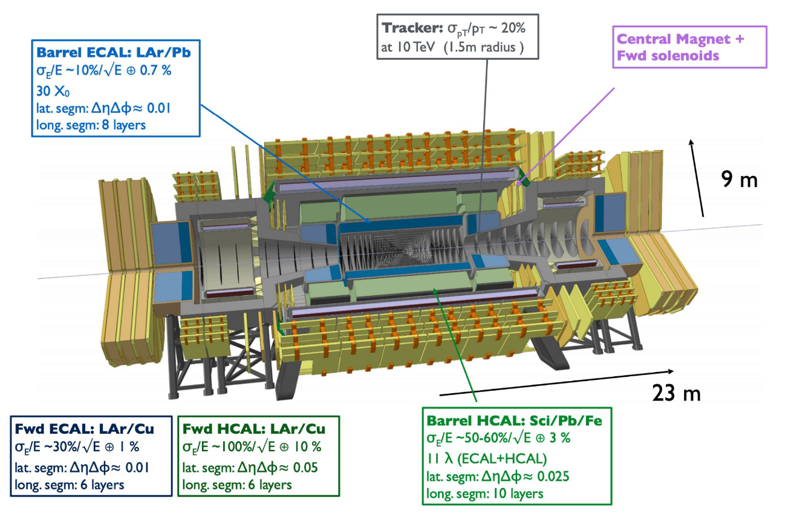

## Welcome to the FCC-hh Physics Performance Documentation

### Table of Contents
1. [Organisation](#organisation)
2. [Overview of goals and studies](#overview-of-goals-and-studies)
3. [How to implement your FCC-hh study ](#how-to-implement-your-fcc-hh-study)

-----

### Organisation

#### Meetings and communication 

E-group for the FCC-hh P&P studies: [fcc-ped-hh-physicsperformance-espp25@cern.ch](mailto:fcc-ped-hh-physicsperformance-espp25@cern.ch)

To subscribe, go [here](https://e-groups.cern.ch/e-groups/EgroupsSearchForm.do).

Monthly meetings are planned for Thursdays, 4PM, CERN time, starting from mid October.
- [Indico category](https://indico.cern.ch/category/18814/)

General e-group for FCC-hh studies and input to the European Strategy Update: [fcc-ped-hh-espp25@cern.ch](mailto:fcc-ped-hh-espp25@cern.ch).

Monthly general meetings on Mondays, ~4PM CERN time, starting from 30.09.2024. 
- [Indico category](https://indico.cern.ch/category/18815/)

A kick-off event for the FCC-hh effort was held on 03.09.2024, the [agenda and slides are available here](https://indico.cern.ch/event/1439072/timetable/).

#### Coordinators
- Angela Taliercio (NorthWestern) - angela.taliercio@cern.ch
- Birgit Stapf (CERN) - birgit.stapf@cern.ch
- Sarah Williams (Cambridge) - sarah.louise.williams@cern.ch

Please don't hesitate to reach out to us with any questions or feedback on this documentation. 

<!-- #### Physics Performance meetings -->
<!-- 
O(monthly) meetings: Mondays, 3pm-5pm, CERN time. Usually the third Monday of each month. 
- [indico category "Physics Performance"](https://indico.cern.ch/category/12894/).

E-group used for announcements: **FCC-PED-FeasibilityStudy**.  -->

---------

### Overview of goals and studies

The scope of this platform is to coordinate the effort of updating and extending the physics and performance studies for the proton-proton phase of the Future Circular Collider (FCC-hh), as input for the 2025 review of the European strategy for particle physics. The original [Conceptual Design Report (CDR)](https://link.springer.com/article/10.1140/epjc/s10052-019-6904-3) has clearly established the primary targets and potential of the FCC-hh phase, but new aspects have emerged since then - such as the consideration of different center of mass energy operating points depending on the R&D progress of the required dipple magnets. One clear goal for the strategy update is therefore to review the key benchmark measurement prospects at the FCC-hh under this aspect. Furthermore, there is ample room to contribute physics studies that were not covered by the CDR, or updates of measurement prospects that might benefit from novel analysis techniques or the inclusion of additional channels. On the performance side, the major goal is to move towards a more full simulation approach, especially considering the impact of pile-up, in stand alone studies to solidify the assumptions on detector performance made by the physics studies. 

We have collected a list of ongoing studies as well as ideas of areas below, but other inputs are welcome of course - please get in touch with us if you would like to join the FCC-hh effort with your idea. More explanation can also be found in [these slides](https://indico.cern.ch/event/1439072/contributions/6106999/attachments/2920406/5125885/FCC-hh%20workshop.pdf) from the kick-off meeting. 

#### Ongoing 

- Higgs self-coupling measurement prospects from di-Higgs production rates: Ongoing efforts in updating the projections in the $b\bar{b}\gamma\gamma$ as well as the $b\bar{b}\tau\tau$ channels. Projection for the rarer, more complex $b\bar{b}\ell\ell + E_{T}^{miss}$ is added. 
<!-- - ALPS study? **TBC** -->
- Jet flavour tagging with transformer architecture

#### Planned studies & ideas 
- Single Higgs measurements:
    - Extending $t\bar{t}H$ measurement to the alternate operating scenarios, exploit $t\bar{t}H/t\bar{t}Z$ ratio to constrain $\kappa_t$, 
      use as input to two-dimensional $\kappa_\lambda \, \text{vs} \, \kappa_t$ constraints combining with self-coupling analyses
    - $H(\mu\mu)$ analyses at alternate energy points
    - Analysis of $t\bar{t}H(\gamma\gamma)$ channel previously uncovered
    - Include previously uncovered channels, e.g. $H \rightarrow WW, bb, cc, \tau\tau$. Opportunity to connect with a flavour tagging performance study
  
-
- Performance studies:
    - More realistic, full simulation tracker studies, e.g. applying ParticleNET, ACTs, including timing information for pile-up suppression, in order to solidify performance benchmarks used by physics studies

----------

### How to implement your FCC-hh study 

#### Overview

 <figure>
  
  <figcaption> <em> Overview of the FCC-hh workflow. Click on the various steps for more information. </em> </figcaption>
</figure> 

<map name="techworkflow">
    <area shape="rect" coords="6,37,279,90" alt="Event generation tutorial for FCC" href="https://hep-fcc.github.io/fcc-tutorials/main/fast-sim-and-analysis/FccFastSimGeneration.html" target="_blank">
    <area shape="rect" coords="286,51,337,73" alt="LHE events database for FCC-hh" href="https://fcc-physics-events.web.cern.ch/FCChh/LHEevents.php" target="_blank">
    <area shape="rect" coords="365,37,607,90" alt="Pythia8" href="https://www.pythia.org/" target="_blank">
    <area shape="rect" coords="637,37,878,90" alt="DELPHES framework for fast simulation of a generic collider experiment" href="https://cp3.irmp.ucl.ac.be/projects/delphes" target="_blank">
    <area shape="rect" coords="705,135,825,155" alt="k4SimDelphes" href="https://github.com/key4hep/k4SimDelphes" target="_blank"> 
    <!-- Alternatively link tutorial> <area shape="rect" coords="705,135,825,155" alt="Tutorial how to use k4SimDelphes" href="https://hep-fcc.github.io/fcc-tutorials/main/fast-sim-and-analysis/k4simdelphes/doc/starterkit/FccFastSimDelphes/Readme.html target="_blank">  -->
    <area shape="rect" coords="640,195,776,220" alt="EDM4hep event data model" href="https://github.com/key4hep/EDM4hep" target="_blank"> 
    <area shape="rect" coords="365,182,607,237" alt="FCCAnalyses framework" href="https://github.com/HEP-FCC/FCCAnalyses" target="_blank"> 
    <area shape="rect" coords="294,197,357,220" alt="ROOT trees information" href="https://root.cern/manual/trees/" target="_blank"> 
    <area shape="rect" coords="6,182,128,237" alt="CMS combine package documentation" href="https://cms-analysis.github.io/HiggsAnalysis-CombinedLimit/latest/" target="_blank">
</map>

The typical technical workflow of a FCC-hh study is illustrated above. We rely on the software tools provided by the [key4hep project](https://github.com/key4hep) - a common, turnkey software stack for future colliders. 

Commonly generators like [MadGraph](https://launchpad.net/mg5amcnlo) and [POWHEG](https://powhegbox.mib.infn.it/) are used for the generation of proton-proton collision events at energies ~ 100 TeV. **Info about the PDF sets TBA**. Those events are stored in the [LHE format](https://arxiv.org/abs/hep-ph/0609017). 

Hadronization, particle decays and a fast detector simulation using parametrizations for resolutions and efficiencies with `DELPHES` are applied in one step, resulting in reconstructed events stored in the `EDM4hep` data model. The available `DELPHES` scenarios for FCC-hh and where to find them are described in more detail [below](#delphes-scenarios-for-FCC-hh-and-official-production-campaigns). 

To process the `EDM4hep` events we use the common `FCCAnalyses` framework, providing multi-threaded vectorial analysis tools using `ROOT`'s [RDataframe class](https://root.cern/doc/master/classROOT_1_1RDataFrame.html). 

The output of `FCCAnalyses` framework can either be another (flat) `ROOT` ntuple, or simple histograms, which can be processed further in the standard ways, e.g. with multi-variate analysis (MVA) libraries, and in the final statistical interpretation with the `combine` statistics tool from the `CMS` collaboration. 

More information, as well as hands-on examples for every one of these steps are given in the [Quick Start Example](#quick-start-example) section below. 

#### Delphes scenarios for FCC-hh and official production campaigns

There are two current `DELPHES` cards available for the FCC-hh studies:
- [Scenario I](https://github.com/delphes/delphes/blob/master/cards/FCC/scenarios/FCChh_I.tcl): An optimistic scenario to study benchmarks reaching ultimate precision. Assumes LHC run 2 conditions with e.g. an ideal crystal calorimeter, b-tagging performances slightly better than with current `CMS` best performance with ParticleNet. 
- [Scenario II](https://github.com/delphes/delphes/blob/master/cards/FCC/scenarios/FCChh_II.tcl): This is the **baseline** scenario based on the FCC-hh general purpose detector concept proposed in the CDR. Compared to the previous FCC-hh card used for the first iteration of FCC-hh physics and performance studies for the CDR this implements several bug fixes (e.g. accounting for electron bremsstrahlung, fixes to parametrization issues).

Click below to see more details on the two scenarios. 

Comparison table Scenario I and II 

This table compares relative momentum resolutions and efficiencies for a few key physics objects between the two scenarios. Please note that the numbers quoted cover the total range of resolutions and efficiencies, so across all transverse momenta and pseudorapidity bins, including the forward regions up to pseudorapities of 6. 

<table class="tg"><thead>
  <tr>
    <th class="tg-0lax"></th>
    <th class="tg-8d8j" colspan="2">  Relative <em>p</em> resolution</th>
    <th class="tg-8d8j" colspan="2">Efficiency</th>
  </tr></thead>
<tbody>
  <tr>
    <td class="tg-7zrl"></td>
    <td class="tg-7zrl">Scenario I</td>
    <td class="tg-7zrl">Scenario II</td>
    <td class="tg-7zrl">Scenario I</td>
    <td class="tg-7zrl">Scenario II</td>
  </tr>
  <tr>
    <td class="tg-7zrl">Electrons</td>
    <td class="tg-8d8j">0.4-1%</td>
    <td class="tg-8d8j">0.8-3%</td>
    <td class="tg-8d8j">76-95%</td>
    <td class="tg-8d8j">72-90%</td>
  </tr>
  <tr>
    <td class="tg-7zrl">Muons</td>
    <td class="tg-8d8j">0.5-3%</td>
    <td class="tg-8d8j">1-6%</td>
    <td class="tg-8d8j">90-99%</td>
    <td class="tg-8d8j">88-97%</td>
  </tr>
  <tr>
    <td class="tg-8d8j" colspan="3">Medium b-tagging </td>
    <td class="tg-8d8j">80-90%</td>
    <td class="tg-8d8j">76-86%</td>
  </tr>
</tbody></table>

Overview of CDR detector concept 

 <figure>
  
  <figcaption> <em> Overview of the FCC-hh baseline detector concept as proposed in the CDR. [Slide from M. Selvaggi] </em> </figcaption>
</figure> 

A database of all large-scale productions of `DELPHES` events for FCC-hh studies can be found [here](https://fcc-physics-events.web.cern.ch/FCChh/index.php). The up-to-date production campaign to use for studies for the 2025 European Strategy update will be using the production tag `v06`. All previous production campaigns are kept for documenation purpose only, click below to see more details. 

FCC-hh production tags

<table class="tg"><thead>
  <tr>
    <th class="tg-7zrl">Production Tag</th>
    <th class="tg-7zrl">Description</th>
  </tr></thead>
<tbody>
  <tr>
    <td class="tg-7zrl">Delphes v0.2</td>
    <td class="tg-0lax">Production for CDR studies, not using EDM4hep yet. Using original baseline DELPHES card (now outdated).</td>
  </tr>
  <tr>
    <td class="tg-7zrl">Delphes v0.3</td>
    <td class="tg-0lax">Production for CDR studies, not using EDM4hep yet. Using original baseline DELPHES card (now outdated).</td>
  </tr>
  <tr>
    <td class="tg-7zrl">Delphes v0.4</td>
    <td class="tg-0lax">First intermediate production switching to EDM4hep. Using original baseline DELPHES card (now outdated).</td>
  </tr>
  <tr>
    <td class="tg-7zrl">Delphes v0.5</td>
    <td class="tg-0lax">Intermediate production using the updated DELPHES scenarios I and II, and pre-release EDM4hep in v0.</td>
  </tr>
  <tr>
    <td class="tg-7zrl">Delphes v0.6</td>
    <td class="tg-0lax">Production for the strategy update 2025 studies - using DELPHES scenarios I and II, and EDM4hep in v1.</td>
  </tr>
</tbody></table>

You can find the `Delphes` scenarios (and all their needed inputs) in the official [DELPHES git repository](https://github.com/delphes/delphes/blob/master/cards/FCC/scenarios) as well as on `eos` under the path `/eos/experiment/fcc/hh/utils/delphescards/`, where they are sorted into subdirectories corresponding to the respective production tags. 

#### Quick start example 

Click on the steps below to see instructions and examples how to implement them. 

  
**Step 1: LHE availability and generation** 

    You can find all already generated processes in the LHE database for FCC-hh [under this link](https://fcc-physics-events.web.cern.ch/FCChh/LHEevents.php). 

  
**Step 2: Fast simulation** 

    **Describtion to be added**

  
**Step 3: Analysis with FCCAnalyses** 

    **Describtion to be added**

  
**Step 4: Statistical interpretation with combine** 

    **Describtion to be added**

----------

----------
 
### Further resources 

Note: To be checked and updated! 

#### Software tutorials

- the [FCCSW tutorials](https://hep-fcc.github.io/fcc-tutorials/)
- the tutorials given for Snowmass (September 2020) have been recorded, see [here](https://indico.cern.ch/event/945608/timetable/#20200922.detailed) and [here](https://indico.cern.ch/event/949950/timetable/?layout=room#20200929.detailed)
- the extremely useful [FCCSW FORUM page](https://fccsw-forum.web.cern.ch/)

#### Useful repositories
- [FCCSW](https://github.com/HEP-FCC/FCCSW)
- [DELPHES]( https://github.com/delphes/delphes)
- [DD4Hep](https://github.com/AIDASoft/DD4hep)
- [key4hep/EDM4hep](https://github.com/key4hep/EDM4hep)
- [FCCAnalyses](https://github.com/HEP-FCC/FCCAnalyses)

