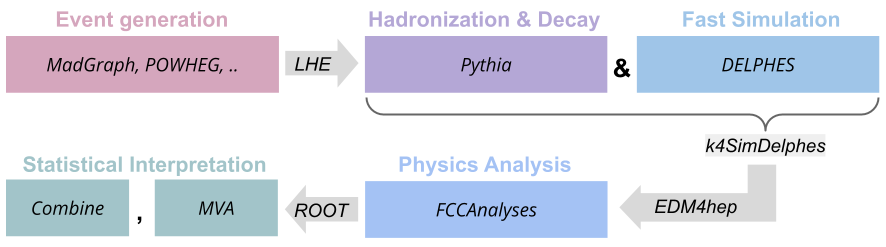

## Welcome to the FCC-hh Physics Performance Documentation

### Table of Contents
1. [Organisation](#organisation)
2. [Overview of goals and studies](#overview-of-goals-and-studies)

-----

### Organisation

#### Meetings and communication 

E-group for the FCC-hh P&P studies: fcc-ped-hh-physicsperformance-espp25@cern.ch

Monthly meetings are planned for Thursdays, 4PM, CERN time, starting from mid October.
- [Indico category](https://indico.cern.ch/category/18814/)

General e-group for FCC-hh studies and input to the European Strategy Update: fcc-ped-hh-espp25@cern.ch

Monthly general meetings on Mondays, ~4PM CERN time, starting from 30.09.2024. 
- [Indico category](https://indico.cern.ch/category/18815/)

A kick-off event for the FCC-hh effort was held on 03.09.2024, the [agenda and slides are available here](https://indico.cern.ch/event/1439072/timetable/).

#### Coordinators
- Angela Taliercio (NorthWestern) - angela.taliercio@cern.ch
- Birgit Stapf (CERN) - birgit.stapf@cern.ch
- Sarah Williams (Cambridge) - sarah.louise.williams@cern.ch

Please don't hesitate to reach out to us with any questions or feedback on this documentation. 

<!-- #### Physics Performance meetings -->
<!-- 
O(monthly) meetings: Mondays, 3pm-5pm, CERN time. Usually the third Monday of each month. 
- [indico category "Physics Performance"](https://indico.cern.ch/category/12894/).

E-group used for announcements: **FCC-PED-FeasibilityStudy**. To subscribe, go [here](https://e-groups.cern.ch/e-groups/EgroupsSearchForm.do). -->

---------

### Overview of goals and studies

The scope of this platform is to coordinate the effort of updating and extending the physics and performance studies for the proton-proton phase of the Future Circular Collider (FCC-hh), as input for the 2025 review of the European strategy for particle physics. The original [Conceptual Design Report (CDR)](https://link.springer.com/article/10.1140/epjc/s10052-019-6904-3) has clearly established the primary targets and potential of the FCC-hh phase, but new aspects have emerged since then - such as the consideration of different center of mass energy operating points depending on the R&D progress of the required dipple magnets. One clear goal for the strategy update is therefore to review the key benchmark measurement prospects at the FCC-hh under this aspect. Furthermore, there is ample room to contribute physics studies that were not covered by the CDR, or updates of measurement prospects that might benefit from novel analysis techniques or the inclusion of additional channels. On the performance side, the major goal is to move towards a more full simulation approach, especially considering the impact of pile-up, in stand alone studies to solidify the assumptions on detector performance made by the physics studies. 

We have collected a list of ongoing studies as well as ideas of areas below, but other inputs are welcome of course - please get in touch with us if you would like to join the FCC-hh effort with your idea. More explanation can also be found in [these slides](https://indico.cern.ch/event/1439072/contributions/6106999/attachments/2920406/5125885/FCC-hh%20workshop.pdf) from the kick-off meeting. 

#### Ongoing 

- Higgs self-coupling measurement prospects from di-Higgs production rates: Ongoing efforts in updating the projections in the $b\bar{b}\gamma\gamma$ as well as the $b\bar{b}\tau\tau$ channels. Projection for the rarer, more complex $b\bar{b}\ell\ell + E_{T}^{miss}$ is added. 
- ALPS study? **TBC**

#### Planned studies & ideas 
- Single Higgs measurements:
    - Extending $ttH$ measurement to the alternate operating scenarios, exploit $ttH/ttZ$ ratio to constrain $\kappa_t$, use as input to two-dimensional $]\kappa_\lambda vs \kappa_t$ constraints combining with self-coupling analyses
    - Include previously uncovered channels, e.g. $H \rightarrow WW, bb, cc, \tau\tau$. Opportunity to connect with a flavour tagging performance study. 

- Performance studies:
    - More realistic, full simulation tracker studies, e.g. applying ParticleNET, ACTs, including timing information for pile-up suppression, in order to solidify performance benchmarks used by physics studies

----------

### How to implement your FCC-hh study 

#### Technical workflow overview 

<map name="techworkflow">
    <area shape="rect" coords="5,37,279,90" alt="Event generation tutorial for FCC" href="https://hep-fcc.github.io/fcc-tutorials/main/fast-sim-and-analysis/FccFastSimGeneration.html" target="_blank">
    <area shape="rect" coords="286,51,337,73" alt="LHE events database for FCC-hh" href="https://fcc-physics-events.web.cern.ch/FCChh/LHEevents.php" target="_blank">
    <area shape="rect" coords="365,37,607,90" alt="Pythia8" href="https://www.pythia.org/" target="_blank">
    <area shape="rect" coords="637,37,878,90" alt="DELPHES framework for fast simulation of a generic collider experiment" href="https://cp3.irmp.ucl.ac.be/projects/delphes" target="_blank">

</map>

#### Quick start example 

Click on the steps below to see instructions and examples how to implement them. 

  
**Step 1: LHE availability and generation** 

    You can find all already generated processes in the LHE database for FCC-hh [under this link](https://fcc-physics-events.web.cern.ch/FCChh/LHEevents.php). 

  
**Step 2: Fast simulation** 

    **Describtion to be added**

  
**Step 3: Analysis with FCCAnalyses** 

    **Describtion to be added**

  
**Step 4: Statistical interpretation with combine** 

    **Describtion to be added**

----------

----------
 
### Further resources 

Note: To be checked and updated! 

#### Software tutorials

- the [FCCSW tutorials](https://hep-fcc.github.io/fcc-tutorials/)
- the tutorials given for Snowmass (September 2020) have been recorded, see [here](https://indico.cern.ch/event/945608/timetable/#20200922.detailed) and [here](https://indico.cern.ch/event/949950/timetable/?layout=room#20200929.detailed)
- the extremely useful [FCCSW FORUM page](https://fccsw-forum.web.cern.ch/)

#### Useful repositories
- [FCCSW](https://github.com/HEP-FCC/FCCSW)
- [DELPHES]( https://github.com/delphes/delphes)
- [DD4Hep](https://github.com/AIDASoft/DD4hep)
- [key4hep/EDM4hep](https://github.com/key4hep/EDM4hep)
- [FCCAnalyses](https://github.com/HEP-FCC/FCCAnalyses)

